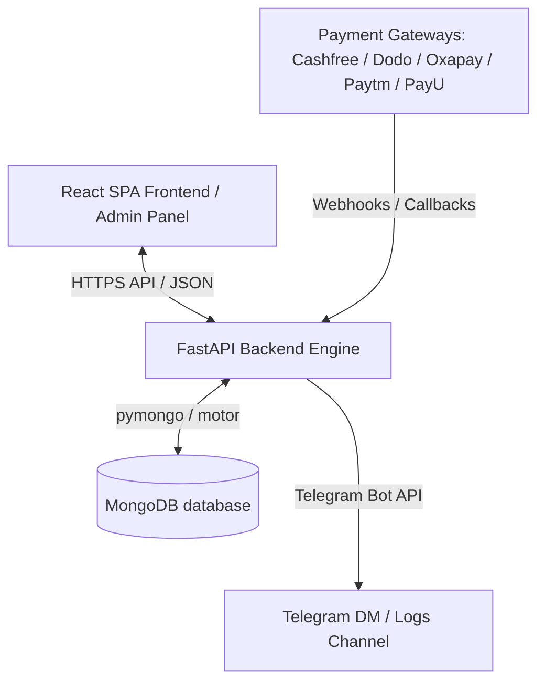
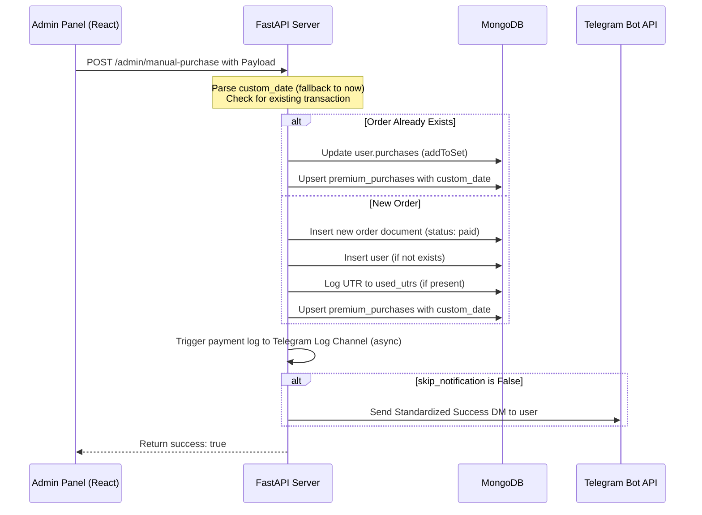

# Arya Premium - System Architecture & Technical Design Specification

This document provides a comprehensive technical overview of the **Arya Premium** platform, covering the system architecture, database design, API endpoints, and key operations logic.

---

## 1. Architectural Overview

Arya Premium consists of a **Single Page Application (SPA)** frontend built with React, communicating with a **FastAPI** backend that interacts with a **MongoDB** database cluster. The system also integrates directly with the Telegram Bot API to notify users, deliver purchased digital stories, and log payment receipts in designated logging channels.



---

## 2. Tech Stack

### Frontend Client
* **Core**: React 18, TypeScript, Vite
* **Styling**: TailwindCSS & Custom CSS
* **Key Components**: Lucide React Icons, Canvas/html2canvas for dynamic receipt generation, Tailwind variables
* **Deployment**: Built to static files, served under `/static_dist` path by the FastAPI backend

### Backend Server
* **Core**: Python 3.10+, FastAPI (ASGI framework)
* **Web Server**: Uvicorn
* **Database Driver**: Motor (async MongoDB driver)
* **Background Tasks**: asyncio tasks for logging, DM messaging, database cleanups

---

## 3. Database Schema Specification (MongoDB)

Arya Premium stores its state across several MongoDB collections. The primary collections are:

### `users`
Represents a Telegram user registered in the system.
* `id` (int/str, Unique): Telegram User ID
* `first_name` (str): First name of the user
* `username` (str, Optional): Telegram username
* `purchases` (list of str): List of canonical story IDs the user has purchased
* `joined_date` (datetime): Timestamp when the user was first recorded

### `premium_stories`
Stores stories available for purchase.
* `_id` (ObjectId): MongoDB internal document ID
* `story_id` (str, Indexed): Unique user-friendly alphanumeric ID for the story
* `story_name_en` (str): English title of the story
* `title` (str): Alternative title field
* `price` (float): Base price
* `discounted_price` (float, Optional): Active sale price

### `orders`
Logs checkout attempts and completed payment records.
* `order_id` (str, Unique): Formatted Order ID (e.g., `AM-1071421266-0408-81032`)
* `user_id` (int/str): Telegram ID of the buyer
* `username` (str)
* `first_name` (str)
* `story_ids` (list of str): Story IDs purchased in this transaction
* `story_names` (list of str)
* `total` / `amount` (float): Amount charged
* `method` (str): Payment gateway name (e.g. `Cashfree`, `Dodo Payments`, `manual_upi`)
* `status` (str): `pending` \| `paid` \| `failed`
* `created_at` (datetime): Order creation date
* `paid_at` (datetime, Optional): Completion date

### `premium_purchases`
Audit log storing individual story grants (one document per story per user purchase).
* `user_id` (int/str): Telegram ID of the buyer
* `story_id` (ObjectId/str): Story ID granted
* `order_id` (str): Associated order ID
* `title` (str): Story title
* `source` (str): `miniapp` \| `bot`
* `method` (str): Resolved payment method
* `purchased_at` (datetime)
* `paid_at` (str, ISO format)

### `used_utrs`
Stores 12-digit UPI UTR numbers to prevent replay attacks and duplicate manual entries.
* `utr` (str, Primary): 12-digit UTR
* `user_id` (int/str)
* `order_id` (str)
* `amount` (float)
* `method` (str)
* `used_at` (datetime)

---

## 4. Key API Endpoints (FastAPI)

All API routes are prefixed by the router config (typically `/api` or directly `/`).

### Admin Routes (Protected)
* **`POST /admin/manual-purchase`**: Grants access to a story manually.
  * *Request Body*:
    ```json
    {
      "telegram_id": "string",
      "user_id": "int/str",
      "first_name": "string",
      "username": "string",
      "story_id": "string",
      "amount": 0.0,
      "source": "miniapp",
      "method": "string",
      "utr_number": "string",
      "custom_date": "YYYY-MM-DD",
      "skip_notification": false
    }
    ```
* **`GET /admin/buyers-data`**: Fetches list of all buyers, purchase history, and stats.

### User & Checkout Routes
* **`GET /library`**: Fetches user's active library and purchased stories.
* **`POST /checkout/create-order`**: Initiates a checkout session for payment gateway integration.

---

## 5. Critical System Flows

### 1. Manual Order Addition Flow (Admin Panel)

When an administrator adds an order from the **Buyers View -> Add Order** dialog, the system follows this workflow:



### 2. Transaction Grouping Logic (Buyers Dashboard)

To display a clean transaction summary without inflating revenue metrics, the `fetch_processed_buyers_data` function groups related story grants inside `premium_purchases` into single purchase rows:

1. **Projection**: Loads `premium_purchases` documents along with `orders`.
2. **Keying**: A grouping key is resolved:
   * If a transaction has a common `reference` string, `group_key` = `ref_{reference}`.
   * If a transaction has a common `order_id` string, `group_key` = `order_{order_id}`.
   * Otherwise, falls back to `batch_{source}_{method}_{date_minute}`.
3. **Merging**: Items sharing the identical grouping key are collapsed into a single row showing `(+X more)` stories. Since we removed the date-split logic, separate transactions on the same day remain as separate entries.
